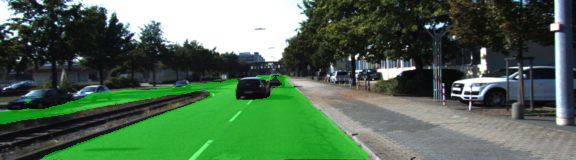

# Semantic Segmentation
## Introduction

This project aims at implementing a Fully Convolutional Neural Network (FCN) based
on a pre-trained VGG16 image classifier. The goal of the FCN is to correctly
classify each image pixel as road / non road. The training dataset is the Kitti
dataset that can be found [here](http://www.cvlibs.net/download.php?file=data_road.zip).

## Approach

### Architecture

Starting from a pre-trained VGG16, I converted the Neural Network to a Fully
Convolutional Neural Network by replacing the fully connected layer with a 1x1
convolution layer. The depth of the 1x1 convolution layer must be equal to the
number of the desired classes we want to classify. In this particular example the
depth is 2 (class 1: **road**, class 2: **non road**).

Following the 1x1 convolution layer I implemented the *skip connections* on VGG16
layers, in particular, on layers 3 and 4. This technique helps the FCN to speed up
the training process as well as the classification. Each skipped layer was upsampled
using a transposed convolution.

### Optimizer

The loss function for the network is the standard cross-entropy with an Adam
optimizer. Please refer to my [transfer learning project](https://github.com/Nallo/CarND-P3-Behavioural-Cloning#training)
for further reading.

### Training

Below are reported the hyper parameters of the model:

| Parameter         | Value  |
|:-----------------:|:------:|
| Keep probability  | 0.5    |
| Learning Rate     | 0.0009 |
| Epochs            | 50     |
| Batch Size        | 5      |


## Results

  * The Loss per batch tends below 0.200 after only two epochs.
  * After more than 10 epochs, the Loss drops below 0.100.
  * At epoch 50: the loss is below 0.0300.

### Samples

Below are depicted a few samples of the model.





### Setup
##### Frameworks and Packages
Make sure you have the following is installed:
 - [Python 3](https://www.python.org/)
 - [TensorFlow](https://www.tensorflow.org/)
 - [NumPy](http://www.numpy.org/)
 - [SciPy](https://www.scipy.org/)
##### Dataset
Download the [Kitti Road dataset](http://www.cvlibs.net/datasets/kitti/eval_road.php) from [here](http://www.cvlibs.net/download.php?file=data_road.zip).  Extract the dataset in the `data` folder.  This will create the folder `data_road` with all the training a test images.

### Start
##### Implement
Implement the code in the `main.py` module indicated by the "TODO" comments.
The comments indicated with "OPTIONAL" tag are not required to complete.
##### Run
Run the following command to run the project:
```
python main.py
```
**Note** If running this in Jupyter Notebook system messages, such as those regarding test status, may appear in the terminal rather than the notebook.

### Submission
1. Ensure you've passed all the unit tests.
2. Ensure you pass all points on [the rubric](https://review.udacity.com/#!/rubrics/989/view).
3. Submit the following in a zip file.
 - `helper.py`
 - `main.py`
 - `project_tests.py`
 - Newest inference images from `runs` folder  (**all images from the most recent run**)

 ### Tips
- The link for the frozen `VGG16` model is hardcoded into `helper.py`.  The model can be found [here](https://s3-us-west-1.amazonaws.com/udacity-selfdrivingcar/vgg.zip)
- The model is not vanilla `VGG16`, but a fully convolutional version, which already contains the 1x1 convolutions to replace the fully connected layers. Please see this [forum post](https://discussions.udacity.com/t/here-is-some-advice-and-clarifications-about-the-semantic-segmentation-project/403100/8?u=subodh.malgonde) for more information.  A summary of additional points, follow.
- The original FCN-8s was trained in stages. The authors later uploaded a version that was trained all at once to their GitHub repo.  The version in the GitHub repo has one important difference: The outputs of pooling layers 3 and 4 are scaled before they are fed into the 1x1 convolutions.  As a result, some students have found that the model learns much better with the scaling layers included. The model may not converge substantially faster, but may reach a higher IoU and accuracy.
- When adding l2-regularization, setting a regularizer in the arguments of the `tf.layers` is not enough. Regularization loss terms must be manually added to your loss function. otherwise regularization is not implemented.

### Using GitHub and Creating Effective READMEs
If you are unfamiliar with GitHub , Udacity has a brief [GitHub tutorial](http://blog.udacity.com/2015/06/a-beginners-git-github-tutorial.html) to get you started. Udacity also provides a more detailed free [course on git and GitHub](https://www.udacity.com/course/how-to-use-git-and-github--ud775).

To learn about REAMDE files and Markdown, Udacity provides a free [course on READMEs](https://www.udacity.com/courses/ud777), as well.

GitHub also provides a [tutorial](https://guides.github.com/features/mastering-markdown/) about creating Markdown files.
